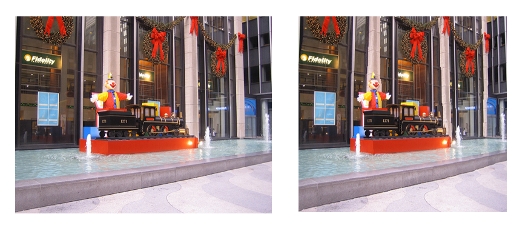

# SeamCarving实现图像智能缩能缩放

> 2017013632 石大川

#### 实现功能

* 所有基本要求
* 分阶段的图像扩展
* 目标移除
* 改进的能量公式

#### 实现说明

* 基本算法

  

  * 水平缩小：

      ```bash
    python -W ignore CAResize.py -i pic1.png -tw 400
      ```
  
    

    左图为原图，右图为实验结果。可见在减小图片宽度的同时较好地保留了重要的区域。

  * 竖直缩小：

      ```bash
    python -W ignore CAResize.py -i pic2.jpg -th 250
      ```
  
    

  左图为原图，右图为实验结果。可见在减小图片高度的同时较好地保留了重要的区域。

  * 能量函数：

      默认为`Gradient`，修改`generate_energy`函数中的参数`mode`为`HoG`后：

      ```bash
    python -W ignore CAResize.py -i pic1.png -tw 400
      ```
  
    

    左图为Gradient，右图为HoG。从红框标出的区域可见对于这张图片Gradient的效果更好。
  
* 分阶段的图像扩展

  我实现了**分阶段的图像扩展**，限制了每个阶段扩展的细缝数为总细缝数目的$\frac{1}{3}$，这个比例可以通过修改`insert_vertical_seam`函数中的`scale`参数来改变。

  除了将最后的按回溯的位置信息删除seam改为添加seam外，单阶段扩展的核心算法和缩小所用的算法是高度重合的。分阶段的扩展就是在此基础上将每次添加的seam数目控制在一定的范围内。

  ```bash
  python -W ignore CAResize.py -i pic3.jpg -tw 700
  ```

  

  左图为原图，右图为扩展后的图，可见被扩展的区域多集中于能量较低的浪花区域，这是符合预期的。

* 目标移除

  我用labelme标出了需要被移除的目标，遍历返回的label文件，直到里面所有被标记的点都被删除：

  

  ```bash
  python -W ignore CAResize.py -i beach.jpg -m beach.npy
  ```

  

  左图为原图，右图为移除指定目标后的结果，可见算法较好地实现了对象移除的功能。

* 改进的能量公式

  按照PPT给的公式修改原来的能量公式即可。

  修改`remove_vertical_seam`函数中的参数`mode`为`forward`后：

  ```bash
  python -W ignore CAResize.py -i pic1.png -tw 400
  ```

  

  左图为原能量公式的结果，右图为前向能量公式的结果，观察图像中间的两根白色柱子和图像下部的斜台阶可见，前向能量公式生成的结果顺滑了很多。

* 效果不佳的图片

  以分阶段的图像扩展为例：

  

  最上方为原图，中间和下方为扩展图。观察最下方图片的鲸鱼和水花可见Artifacts变得比较明显了。这是因为当复制的seam过多时算法的效果就类似于直接做resize了，所以会产生明显的拉伸感。

#### [Report](./report.pdf)